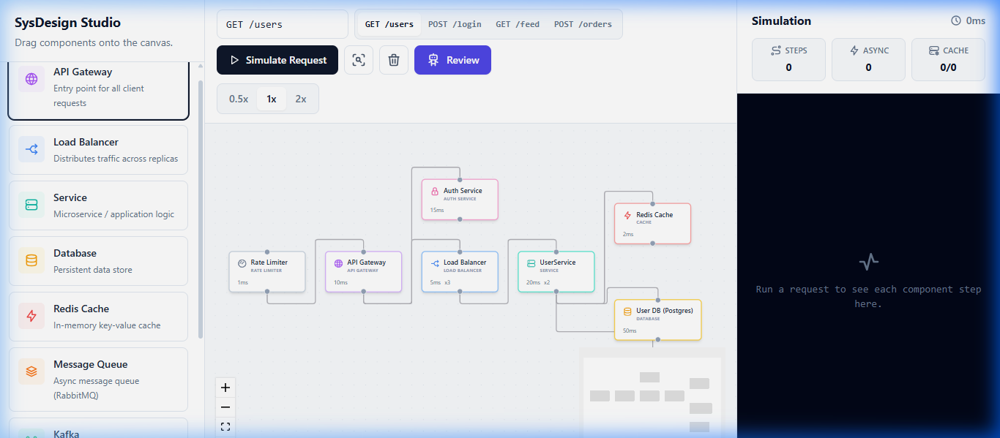
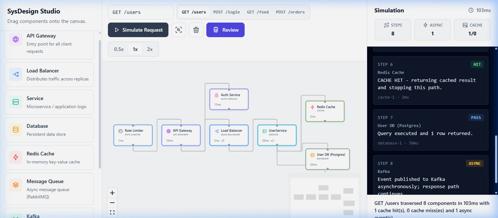
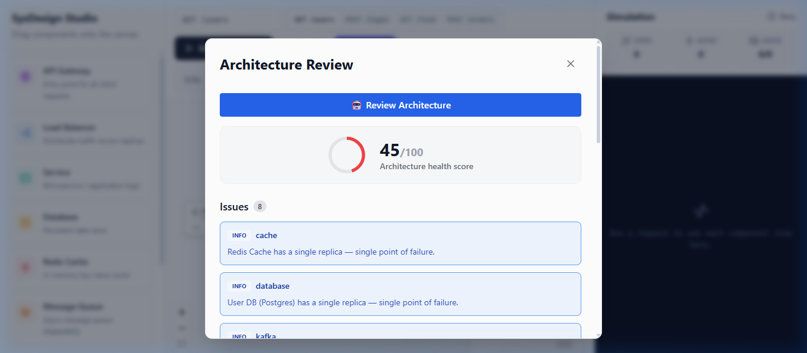

# 🎨 SysDesign Studio — Figma for Backend Architecture

[](https://react.dev/)
[](https://www.typescriptlang.org/)
[](https://spring.io/projects/spring-boot)
[](https://www.postgresql.org/)
[](https://redis.io/)
[](https://kafka.apache.org/)
[](https://openai.com/)

**SysDesign Studio** is an interactive, full-stack visual workspace designed to bring static backend architecture diagrams to life. 

Normally, engineers sketch system architectures on whiteboards or static design tools (like Visio or Lucidchart). Those drawings are flat—they do not *do* anything. **SysDesign Studio solves this by making the canvas live**: you can drag-and-drop components, connect them to specify data flow, run real-time request simulations to find bottlenecks, and get an automated, AI-powered system health grade with actionable architectural review recommendations.

---

## 🍽️ The Restaurant Analogy

If you have never designed a system before, think of software architecture like a massive, multi-story restaurant:
- **API Gateway (Receptionist)**: Greets everyone at the door, checks their reservations, and blocks unwanted guests.
- **Load Balancer (Traffic Cop)**: Directs customers evenly across dining rooms so no single room or server gets overcrowded.
- **Microservices (Kitchen Rooms)**: Specialized rooms with chefs preparing specific dishes (e.g., Auth Service, Payment Service).
- **Redis Cache (Desk Notepad)**: A quick cheat-sheet notepad at the front desk of the most popular items, so you don't have to walk all the way to the giant **Database (Filing Cabinet)** in the basement for every single request.
- **Kafka / Message Queue (To-Do List)**: A buffer queue for tasks that can be done later (like sending a "Thank You" receipt), allowing the main table to finish their meal immediately without waiting on background chores.

---

## 📸 Screenshots in Action

### 1. Interactive Design Canvas
Build complex, multi-tiered architectures using the custom ReactFlow-based drag-and-drop canvas.


### 2. Real-Time Request Simulation
Type a mock HTTP request (e.g., `GET /users`) and watch the data travel step-by-step across servers, load balancers, caches, databases, and background brokers.


### 3. AI-Powered Heuristic Review Panel
Grades your architecture (0-100) using a local Rule Engine combined with OpenAI/Groq Llama-3 model analysis to detect Single Points of Failure (SPOFs), missing cache layers, or security issues.


---

## 🚀 Core Features

1. **Interactive Node Canvas**: Support for custom node components (API Gateway, Load Balancers with round-robin replicas, Microservices, Redis Caches, PostgreSQL databases, Kafka streams, Auth services, and Rate limiters).
2. **Real-Time Simulation Playback**: Uses an asynchronous graph-traversal engine (BFS) to trace request execution. Streams steps in real-time over **WebSockets (STOMP)** with simulated latency animations.
3. **Advanced Flow Logic**: Automatically calculates Cache Hits vs. Cache Misses (randomized path diversion) and Asynchronous pathways (non-blocking Kafka events).
4. **Architectural Auditing (AI & Rules)**: Automatically runs deterministic heuristic rules (e.g., flagging missing auth or single points of failure) combined with OpenAI/Groq API prompts to provide expert system design advice.
5. **Robust Local Caching**: Redis caches simulation responses dynamically to avoid redundant CPU-heavy math calculations on identical designs.

---

## 🛠️ Technology Stack

### Frontend (`sysdesign-studio`)
* **React 18 & TypeScript**: Core component framework.
* **ReactFlow v11**: High-performance mathematical canvas wrapper rendering nodes, edges, grids, and minimaps.
* **Zustand**: Lightweight client state management for persistence (LocalStorage mirroring).
* **TailwindCSS**: Sleek modern user interface styling.

### Backend (`sysdesign-api`)
* **Java 25 & Spring Boot 3.4**: High-concurrency enterprise api layer.
* **Spring WebSockets (STOMP)**: Real-time full-duplex messaging interface to stream simulation packets step-by-step.
* **Spring Data JPA & Hibernate**: Database object relational mapper.
* **Strategy Pattern & BFS Graph Engine**: Backend architecture traversing nodes using a Strategy Pattern based on component type.

### Infrastructure & Operations
* **PostgreSQL**: Permanent persistence for saving canvas architectures.
* **Redis**: Microsecond-latency cache.
* **Apache Kafka & Zookeeper**: Asynchronous simulation audit logging.
* **Docker & Docker Compose**: Unified container orchestration.

---

## 📦 Local Startup Guide

### Prerequisites
Ensure you have the following installed:
- [Docker Desktop](https://www.docker.com/products/docker-desktop/) (must be running)
- [Java 25 JDK](https://adoptium.net/) & [Maven](https://maven.apache.org/)
- [Node.js](https://nodejs.org/) (v18+)

---

### Step 1: Start Infrastructure (Docker)
Open a terminal in the root project directory and start the database and messaging infrastructure:
```bash
docker compose up -d postgres redis zookeeper kafka
```
*Note: This runs the underlying containers in the background, allowing you to run the API and Frontend locally with hot-reloading.*

---

### Step 2: Start the Java Backend
Open a second terminal window and execute the backend startup script:
```powershell
.\start-backend.ps1
```
*The Spring Boot server will run on [http://localhost:8080](http://localhost:8080).*

---

### Step 3: Start the React Frontend
Open a third terminal, navigate to the frontend folder, install dependencies, and run:
```bash
cd sysdesign-studio
npm install
npm run dev
```
*The React developer server will start on [http://localhost:5173](http://localhost:5173).*

---

### Step 4: Running Tests

#### Backend JUnit 5 Tests (Deterministic & AI Rules)
Open a terminal in the root folder and run:
```powershell
.\test-backend.ps1
```
*Verifies backend rule engine validations, AI feedback parsing, API key fallback, and response score merging.*

#### Frontend Jest Tests
Open a terminal in the `sysdesign-studio` folder and run:
```bash
npm test
```
*Runs frontend Jest/React Testing Library suites confirming Canvas and Review modal interaction rendering.*

---

## 🎬 Showcase Demos to Try

### 🏗️ Demo 1: The Basic Startup App (Simple & Flawed)
* **Setup**: `API Gateway` ➡️ `Service` ➡️ `Database`
* **Simulation**: Standard request flows straight to the Database, incurring a heavy latency penalty (50ms+).
* **AI Heuristics Grade**: Low score (~50/100). Flags a **Critical Warning** for a missing cache layer and a **Single Point of Failure (SPOF)** because if the single database or service fails, the entire application crashes.

### 🚀 Demo 2: High-Traffic E-Commerce App (Optimized)
* **Setup**: `API Gateway` ➡️ `Load Balancer` ➡️ `Service` ➡️ `Redis Cache` & `Database`
* **Simulation**: Requests check the Redis Cache first. If it's a **Cache Hit**, the flow returns immediately with low latency (~2ms). If a **Cache Miss** occurs, the flow continues to the Database.
* **AI Heuristics Grade**: High score (90+). Praises high availability (Load Balancer replicas) and latency optimization (Redis layer).

### 📨 Demo 3: Asynchronous Data Pipeline (Advanced)
* **Setup**: `API Gateway` ➡️ `Service` ➡️ `Database` AND `Service` ➡️ `Kafka` ➡️ `Notification Worker`
* **Simulation**: The request flows to the Database and returns to the client instantly, while the Kafka link continues running asynchronously to trigger background tasks (represented by non-blocking dashes).

---

## 📂 Project Directory Structure

```text
System-Design-Studio/
├── .github/                   # GitHub workflows and settings
├── docs/
│   └── screenshots/           # Application screenshots for README
├── k8s/                       # Kubernetes deployment configurations
├── sysdesign-api/             # Java Spring Boot backend
│   ├── src/main/java          # Business logic, strategy patterns, WebSockets
│   └── src/test/java          # Heuristic and AI rule verification tests
├── sysdesign-studio/          # React + Vite frontend
│   ├── src/components         # Interactive Canvas & Property Palette components
│   ├── src/store              # Zustand state store
│   └── src/engine             # Frontend traversal & WebSocket client engine
├── docker-compose.yml         # Dev database & queue configurations
├── start-backend.ps1          # Backend startup helper script
└── README.md                  # This file
```

---

## 🛡️ License
Distributed under the MIT License. See `LICENSE` for more information.
